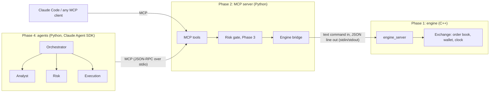

# Learning guide

This file explains *why* the project is built the way it is, phase by phase.
Read a chapter, then do its "Try it" section. Those commands are the fastest way
to understand the flow.

## The big picture



There are three layers and two boundaries. Each layer only knows about the one
directly below it:

- **The C++ engine** knows about orders and money. It knows nothing about AI.
- **The MCP server** turns engine commands into *tools* that any AI client can discover and call.
- **The agents** decide what to do. They can only act through tools.

This separation is the main idea of the project. You can test the engine
without Python, test the MCP server without a model, and later swap the agents
without touching the exchange.

---

## Phase 1: making the simulator drivable

### The problem

Your original `main.cpp` was built for a person: print a menu, read a number,
print a result. A program can't use that reliably, because it would have to
scrape text like `*** YOUR TRADE FILLED ***`.

### The fix: a line protocol

`engine_server` reads **one command per line** and writes **one JSON object per line**:

```
> book ETH/USDT 2
< {"ok":true,"product":"ETH/USDT","best_bid":117.056,"best_ask":117.329,...}
> place bid ETH/USDT 200 1
< {"ok":true,"order_id":1,...}
> step
< {"ok":true,"fills":[{"order_id":1,"side":"bid","price":117.329,"amount":1}],...}
```

Why this design:

| Choice | Why |
|---|---|
| Separate process instead of Python bindings (pybind11) | No build tooling to fight; the engine stays plain C++17; a crash in C++ can't take Python down with it. |
| JSON *out*, plain words *in* | Writing JSON in C++ is about 30 lines. Parsing it needs a library. Our inputs are tiny, so words are enough. |
| One reply per command, always | The client never has to guess whether more output is coming. That makes it simple and safe to use from Python. |
| Errors are replies (`{"ok":false,...}`), not crashes | A bad command from an agent is normal. The engine must keep running. |

### Rule #1: stdout is sacred

When stdout is the protocol, **any** stray `std::cout` corrupts a reply. That's
why `exchange.hpp` never prints, and why `CSVReader::readCSV` returns its
bad-line count instead of printing it. The same rule comes back in Phase 2 for
the MCP server.

### What changed in the trading logic

- **`Exchange` class.** This is the old `MerkelMain` without the menu: it owns
  the `OrderBook`, the `Wallet` and the clock (`stepIndex` over the 8 timestamps).
- **Fund reservation.** Before, you could place two bids that each passed
  `canFulfillOrder`, but which together cost more than you have.
  `Exchange::available()` subtracts what open orders have already promised.
- **Orders live for one step.** Unfilled agent orders are erased after matching,
  so a stale order can't sit in the book and fill later at a price the agent
  never meant to accept.
- **Order ids.** Each agent order gets an id, so a fill can be traced to the
  order that caused it. The eval harness depends on this.
- **The market closes.** The old `getNextTime` wrapped back to the start. A
  replay needs a clear end, so `done` becomes true after the last step.

### Try it

```bash
mingw32-make engine
```

```bash
./build/engine_server.exe engine/data/20200317.csv
```

Then type `products`, `book ETH/USDT 3`, `place bid ETH/USDT 200 1`, `step` and
`wallet`, one per line. Type `quit` to exit. You're doing by hand exactly what
the agents will do.

Run the C++ tests: `mingw32-make test-cpp`.

---

## Phase 2: the MCP server

### What MCP is

The **Model Context Protocol** is a standard way for an AI application (the
*client*) to use capabilities provided by another program (the *server*). The
client launches the server, asks `tools/list`, and gets back each tool's name,
description and **JSON Schema** for its arguments. The model reads those
descriptions and decides which tool to call. The client sends `tools/call` and
returns the result to the model.

Because it's a standard, one server works with Claude Code, Claude Desktop, and
our own agents. You don't write a separate integration for each.

### How our server is put together

`src/trading_desk/engine.py` is the **bridge**. It starts `engine_server` with
`subprocess.Popen`, writes a command, and reads one line back. Two details matter:

- **A lock around send/receive.** If two tool calls overlapped, they could each
  read the other's reply.
- **Input validation.** Tool arguments come from a language model, so treat them
  as untrusted. A product like `"ETH/USDT\nreset"` would smuggle in a second
  command. `_check_product` only accepts the `BASE/QUOTE` shape. That's the same
  idea as preventing SQL injection.

`src/trading_desk/mcp_server.py` declares the tools:

```python
@mcp.tool()
def place_order(side: Literal["bid", "ask"], product: str, price: float, amount: float) -> dict:
    """Places a limit order at the current time step. ..."""
```

The SDK reads the **type hints** to build the JSON Schema
(`Literal["bid","ask"]` becomes an `enum`, so the model can't send `"buy"`), and
the **docstring** becomes the description the model reads. Writing a docstring
here is writing a prompt.

**Tool errors vs crashes.** When the engine says "insufficient USDT", we raise
`ToolError`. The client gets a normal result with `is_error=True`, the model
reads the message, and it can try again with a smaller order. That's how agents
recover from mistakes.

**`INSTRUCTIONS`** are sent to the client on connect. They explain the rules
that no single tool can (time steps, how fills work).

### Rule #1 again

The MCP stdio transport uses stdout for JSON-RPC, so `main()` sends logging to
stderr. We now have two processes whose stdout is a protocol.

### Try it

```bash
uv sync
```

```bash
uv run pytest -q
```

`tests/test_mcp_server.py` connects a real MCP client to the server in-process,
so the tests exercise the same path Claude Code uses.

Then open this folder in Claude Code. `.mcp.json` registers the server, so you
can ask: *"What's the spread on ETH/USDT right now? Buy 1 ETH at the best ask,
then advance time and show me my wallet."* Watch which tools it calls.

---

## Phase 3: risk limits as code

### Judgement vs. guarantees

Phase 4 adds a *risk agent* that reviews each trade. A model's review is
useful, but it isn't a guarantee: it can be skipped, talked around, or just
wrong. So there are two layers:

| Layer | What it is | What it's for |
|---|---|---|
| `RiskGate` (`risk.py`) | Plain Python, deterministic | Hard limits. Inside `place_order`, so **no client can bypass it** |
| Risk agent (Phase 4) | A model with read-only tools | Judgement: "is this a sensible trade?" |

Putting the gate in the MCP server, not in the agent code, matters: Claude
Code, a script, or a misbehaving agent all go through the same check.

### The limits (`RiskLimits`)

| Limit | Default | Stops |
|---|---|---|
| `max_order_notional_usdt` | 10,000 | one oversized order |
| `max_position_usdt` | 75,000 | piling into one currency (balance + pending buys) |
| `max_open_orders` | 5 | order spam |
| `max_price_deviation` | 2% from mid | "fat finger" prices |

Everything is valued in **USDT** (`market.py`). ETH/BTC is priced in BTC, so a
notional of 1 ETH there is `amount × price × (BTC in USDT)`. Currencies without
a direct USDT book are valued through a cross.

The position limit applies to the currency an order *receives*: buying BTC
grows BTC, selling ETH for BTC grows BTC, selling anything for USDT grows cash
(no limit). Pending orders count too. Otherwise five orders that are each
fine could add up to a breach.

### Making failures visible

- A blocked order is a **tool error** starting with `RISK REJECTED:` plus the
  reasons, so the model knows *why* and can resize.
- `check_order` is a dry run, so agents can ask before acting. Dry runs don't
  count as breaches. Only actual attempts to place a bad order do.
- **The journal.** With `TRADING_JOURNAL=run.jsonl`, the server appends every
  tool call (with status `ok` / `error` / `risk_rejected`), plus a wallet
  snapshot after each `advance_time`. Phase 6 scores runs from this file. The
  scorer then trusts what actually happened at the exchange, not the agent's
  own summary of it.

### Try it

In Claude Code, ask: *"Buy 100 ETH at the best ask."* It will be rejected (about
11,700 USDT, over the notional limit). Watch whether it reads the reason and
resizes. Then look at `get_risk_limits`.

---

*Phases 4–7 are added here as they're built. See [PLAN.md](PLAN.md).*
