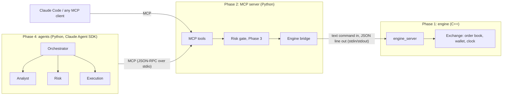

# Learning guide

This file explains *why* the project is built the way it is, phase by phase.
Read a chapter, then do its "Try it" section. Those commands are the fastest way
to understand the flow.

## The big picture



There are three layers and two boundaries. Each layer only knows about the one
directly below it:

- **The C++ engine** knows about orders and money. It knows nothing about AI.
- **The MCP server** turns engine commands into *tools* that any AI client can discover and call.
- **The agents** decide what to do. They can only act through tools.

This separation is the main idea of the project. You can test the engine
without Python, test the MCP server without a model, and later swap the agents
without touching the exchange.

---

## Phase 1: making the simulator drivable

### The problem

Your original `main.cpp` was built for a person: print a menu, read a number,
print a result. A program can't use that reliably, because it would have to
scrape text like `*** YOUR TRADE FILLED ***`.

### The fix: a line protocol

`engine_server` reads **one command per line** and writes **one JSON object per line**:

```
> book ETH/USDT 2
< {"ok":true,"product":"ETH/USDT","best_bid":117.056,"best_ask":117.329,...}
> place bid ETH/USDT 200 1
< {"ok":true,"order_id":1,...}
> step
< {"ok":true,"fills":[{"order_id":1,"side":"bid","price":117.329,"amount":1}],...}
```

Why this design:

| Choice | Why |
|---|---|
| Separate process instead of Python bindings (pybind11) | No build tooling to fight; the engine stays plain C++17; a crash in C++ can't take Python down with it. |
| JSON *out*, plain words *in* | Writing JSON in C++ is about 30 lines. Parsing it needs a library. Our inputs are tiny, so words are enough. |
| One reply per command, always | The client never has to guess whether more output is coming. That makes it simple and safe to use from Python. |
| Errors are replies (`{"ok":false,...}`), not crashes | A bad command from an agent is normal. The engine must keep running. |

### Rule #1: stdout is sacred

When stdout is the protocol, **any** stray `std::cout` corrupts a reply. That's
why `exchange.hpp` never prints, and why `CSVReader::readCSV` returns its
bad-line count instead of printing it. The same rule comes back in Phase 2 for
the MCP server.

### What changed in the trading logic

- **`Exchange` class.** This is the old `MerkelMain` without the menu: it owns
  the `OrderBook`, the `Wallet` and the clock (`stepIndex` over the 8 timestamps).
- **Fund reservation.** Before, you could place two bids that each passed
  `canFulfillOrder`, but which together cost more than you have.
  `Exchange::available()` subtracts what open orders have already promised.
- **Orders live for one step.** Unfilled agent orders are erased after matching,
  so a stale order can't sit in the book and fill later at a price the agent
  never meant to accept.
- **Order ids.** Each agent order gets an id, so a fill can be traced to the
  order that caused it. The eval harness depends on this.
- **The market closes.** The old `getNextTime` wrapped back to the start. A
  replay needs a clear end, so `done` becomes true after the last step.

### Try it

```bash
mingw32-make engine
```

```bash
./build/engine_server.exe engine/data/20200317.csv
```

Then type `products`, `book ETH/USDT 3`, `place bid ETH/USDT 200 1`, `step` and
`wallet`, one per line. Type `quit` to exit. You're doing by hand exactly what
the agents will do.

Run the C++ tests: `mingw32-make test-cpp`.

---

## Phase 2: the MCP server

### What MCP is

The **Model Context Protocol** is a standard way for an AI application (the
*client*) to use capabilities provided by another program (the *server*). The
client launches the server, asks `tools/list`, and gets back each tool's name,
description and **JSON Schema** for its arguments. The model reads those
descriptions and decides which tool to call. The client sends `tools/call` and
returns the result to the model.

Because it's a standard, one server works with Claude Code, Claude Desktop, and
our own agents. You don't write a separate integration for each.

### How our server is put together

`src/trading_desk/engine.py` is the **bridge**. It starts `engine_server` with
`subprocess.Popen`, writes a command, and reads one line back. Two details matter:

- **A lock around send/receive.** If two tool calls overlapped, they could each
  read the other's reply.
- **Input validation.** Tool arguments come from a language model, so treat them
  as untrusted. A product like `"ETH/USDT\nreset"` would smuggle in a second
  command. `_check_product` only accepts the `BASE/QUOTE` shape. That's the same
  idea as preventing SQL injection.

`src/trading_desk/mcp_server.py` declares the tools:

```python
@mcp.tool()
def place_order(side: Literal["bid", "ask"], product: str, price: float, amount: float) -> dict:
    """Places a limit order at the current time step. ..."""
```

The SDK reads the **type hints** to build the JSON Schema
(`Literal["bid","ask"]` becomes an `enum`, so the model can't send `"buy"`), and
the **docstring** becomes the description the model reads. Writing a docstring
here is writing a prompt.

**Tool errors vs crashes.** When the engine says "insufficient USDT", we raise
`ToolError`. The client gets a normal result with `is_error=True`, the model
reads the message, and it can try again with a smaller order. That's how agents
recover from mistakes.

**`INSTRUCTIONS`** are sent to the client on connect. They explain the rules
that no single tool can (time steps, how fills work).

### Rule #1 again

The MCP stdio transport uses stdout for JSON-RPC, so `main()` sends logging to
stderr. We now have two processes whose stdout is a protocol.

### Try it

```bash
uv sync
```

```bash
uv run pytest -q
```

`tests/test_mcp_server.py` connects a real MCP client to the server in-process,
so the tests exercise the same path Claude Code uses.

Then open this folder in Claude Code. `.mcp.json` registers the server, so you
can ask: *"What's the spread on ETH/USDT right now? Buy 1 ETH at the best ask,
then advance time and show me my wallet."* Watch which tools it calls.

---

## Phase 3: risk limits as code

### Judgement vs. guarantees

Phase 4 adds a *risk agent* that reviews each trade. A model's review is
useful, but it isn't a guarantee: it can be skipped, talked around, or just
wrong. So there are two layers:

| Layer | What it is | What it's for |
|---|---|---|
| `RiskGate` (`risk.py`) | Plain Python, deterministic | Hard limits. Inside `place_order`, so **no client can bypass it** |
| Risk agent (Phase 4) | A model with read-only tools | Judgement: "is this a sensible trade?" |

Putting the gate in the MCP server, not in the agent code, matters: Claude
Code, a script, or a misbehaving agent all go through the same check.

### The limits (`RiskLimits`)

| Limit | Default | Stops |
|---|---|---|
| `max_order_notional_usdt` | 10,000 | one oversized order |
| `max_position_usdt` | 75,000 | piling into one currency (balance + pending buys) |
| `max_open_orders` | 5 | order spam |
| `max_price_deviation` | 2% from mid | "fat finger" prices |

Everything is valued in **USDT** (`market.py`). ETH/BTC is priced in BTC, so a
notional of 1 ETH there is `amount × price × (BTC in USDT)`. Currencies without
a direct USDT book are valued through a cross.

The position limit applies to the currency an order *receives*: buying BTC
grows BTC, selling ETH for BTC grows BTC, selling anything for USDT grows cash
(no limit). Pending orders count too. Otherwise five orders that are each
fine could add up to a breach.

### Making failures visible

- A blocked order is a **tool error** starting with `RISK REJECTED:` plus the
  reasons, so the model knows *why* and can resize.
- `check_order` is a dry run, so agents can ask before acting. Dry runs don't
  count as breaches. Only actual attempts to place a bad order do.
- **The journal.** With `TRADING_JOURNAL=run.jsonl`, the server appends every
  tool call (with status `ok` / `error` / `risk_rejected`), plus a wallet
  snapshot after each `advance_time`. Phase 6 scores runs from this file. The
  scorer then trusts what actually happened at the exchange, not the agent's
  own summary of it.

### Try it

In Claude Code, ask: *"Buy 100 ETH at the best ask."* It will be rejected (about
11,700 USDT, over the notional limit). Watch whether it reads the reason and
resizes. Then look at `get_risk_limits`.

---

### A data quirk worth knowing

The last time step of `20200317.csv` only contains BTC-quoted books (ETH/BTC,
DOGE/BTC). Every USDT book is empty. Without a fix, two things break there:
the gate can't value any order, so it rejects them all, and the final
mark-to-market values BTC and ETH at zero. `PriceTracker` carries the last
known USDT price forward and lists those currencies in `stale_prices`. Real
market data always has gaps like this, so valuation code has to expect them.

---

## Phase 4: the agents

### Why several agents instead of one?

One agent with every tool could do the job. Splitting it up buys three things:

- **Least privilege.** The analyst can't place orders, because it is never
  shown the tool. A confused or prompt-injected analyst can't trade.
- **Focused context.** Each sub-agent starts fresh with only its own prompt
  and the task the orchestrator hands it. The analyst's 5-level book dumps
  never clutter the orchestrator's context.
- **Checks and balances.** A proposal has to pass a second agent (risk) and the
  code gate before anything executes.

### How the Agent SDK pieces map to the design (`src/trading_desk/agents.py`)

| Design idea | SDK feature |
|---|---|
| Orchestrator | the main `query()` session, with `system_prompt=ORCHESTRATOR_PROMPT` |
| Sub-agents | `agents={"analyst": AgentDefinition(...), ...}`, invoked via the built-in `Agent` tool |
| Per-agent tool access | `AgentDefinition(tools=[...])` |
| The exchange | `mcp_servers={"trading-desk": {"type": "stdio", "command": python, "args": ["-m", "trading_desk.mcp_server"]}}` |
| No file or shell access at all | `tools=["Agent"]` (the only built-in tool kept) |
| Nothing runs unless pre-approved | `permission_mode="dontAsk"` + `allowed_tools` |
| Role enforcement | a `PreToolUse` hook (`enforce_roles`) |
| Cost guard | `max_budget_usd`, `max_turns` |

MCP tools show up to the model as `mcp__<server>__<tool>`, e.g.
`mcp__trading-desk__place_order`. That's the name used in tool lists and hooks.

### Defence in depth: three layers

```
analyst tries place_order
  1. not in its tool list           -> the model never sees the tool
  2. PreToolUse hook: role_decision -> denied: "analyst may not call place_order"
  3. MCP server risk gate           -> limits checked for every caller
```

Why have the hook when tool lists already restrict access? Because
`allowed_tools` is session-wide: `place_order` must be pre-approved for the
execution agent, so the *orchestrator* could call it too. The hook reads
`agent_type` (set when a sub-agent makes the call) and allows `place_order`
only for `execution`, and `advance_time` only for the orchestrator.
`role_decision` is a pure function, so `tests/test_agents.py` tests every case
without calling a model.

### Agents talk in JSON

Each sub-agent's prompt ends with an exact JSON shape (`{"ideas": [...]}`,
`{"decisions": [...]}`, `{"placed": [...]}`). The orchestrator passes those
between agents. A fixed shape makes the hand-offs predictable and easy to check
in a transcript.

### Try it

You need the Claude Code CLI (`claude`) on PATH, or `--cli-path`, plus
credentials (`ANTHROPIC_API_KEY` or a Claude login). Then:

```bash
uv run python -m trading_desk.agents --max-budget-usd 3
```

It writes `runs/desk.jsonl` (the server's journal) and
`runs/desk.transcript.jsonl` (every message). Read the transcript to see each
hand-off between agents.

---

## Phase 5: Agent Skills

A **skill** is a folder with a `SKILL.md`: a name, a one-line description, and
instructions. Claude sees only the description until the skill is relevant;
then it loads the whole file. Skills are how you package know-how once and
reuse it in every session and every agent.

| Skill | Used by | Teaches |
|---|---|---|
| `read-order-book` | analyst | mid, spread in bps, depth, how fills work, cross-rate gaps |
| `place-safe-order` | risk, execution | limits → funds → `check_order` → place, plus a sizing formula |
| `trading-session` | you, in Claude Code | stepping through a session, and how runs are scored |

They live in `.claude/skills/`, so they work in two places:
- **Our agents:** `AgentDefinition(skills=[...])`, loaded through `setting_sources=["project"]`.
- **Any Claude Code session in this repo:** ask "run a trading session" and it
  finds `trading-session` by its description.

Prompt vs. skill: the **prompt** says *who you are and what to return*; the
**skill** says *how to do the work well*. Keeping them separate keeps prompts
short and lets several agents share the same know-how.

The numbers in `read-order-book` were measured, not assumed: on every step,
the ETH cross-rate gap (at most 10 bps) is smaller than the spreads you'd cross
to capture it (at least 25 bps). Teaching the analyst that "doing nothing" is
often right is part of the skill.

---

## Phase 6: the evaluation harness

### Why evaluate at all?

An agent that *says* "I made 200 USDT" proves nothing. You need a repeatable
run with numbers you trust, so you can tell whether a prompt change, a new
model or a new skill actually helped.

### Design (`src/trading_desk/evals.py`)

1. **Same start every time.** Each run gets a fresh engine at step 0 with the
   starting wallet, and plays to the close.
2. **Same road to the exchange.** Baselines and the agent desk both go through
   the MCP server, so the same risk gate and the same journal apply.
3. **Score from the journal, not the transcript.** The server logs what
   actually happened; the agent's final report is not trusted for numbers.

### The PnL definition (the subtle part)

The starting wallet holds about 53,000 USDT of BTC. If BTC rises 1%, every run
"makes" 530 USDT just by holding. So:

```
pnl = value(final wallet, final prices) − value(starting wallet, final prices)
```

Holding still scores **exactly 0**, and only the agent's trading decisions move
the number. `test_pnl_ignores_market_drift` pins this down.

### Baselines: why scripted traders matter

| Baseline | What it does | What it proves |
|---|---|---|
| `hold` | never trades | the reference: PnL must be 0 |
| `taker` | buys at the ask and sells at the bid on alternate steps | crossing the spread costs money |
| `momentum` | follows the last mid move, checking risk first | a "real" strategy, and it still loses after spreads |
| `reckless` | oversized orders, fat-finger price, unknown product | the harness **catches** breaches and failures |

Baselines are free, deterministic and run in CI on every push. The agent run
costs money, so it's opt-in (`--agent`). A useful first question for any agent
result: *does it beat `hold`?* On this snapshot, `hold` is hard to beat,
because no strategy here earns more than the spreads cost.

### Checks (`--check`)

`check()` turns expectations into a pass/fail exit code that CI can enforce:
`hold` is exactly 0, careful baselines never breach, `reckless` mistakes are
counted, every run reaches the close, and an agent stays under
`--max-agent-breaches` / `--max-agent-failed-calls`. A harness that can't fail
isn't testing anything.

### Try it

```bash
uv run python -m trading_desk.evals --check
```

The command writes `runs/eval-<time>/report.md`, `report.json`, and one journal
per run. Open a journal: every line is a tool call or a wallet snapshot.

---

## Phase 7: Docker and CI

### The Dockerfile: two stages

```
stage 1  gcc:14            compile engine_server + test_exchange, run the C++ tests
stage 2  python:3.12-slim  uv sync, copy the engine binary in, run the evals
```

- **The build is a test.** `./build/test_exchange` runs inside stage 1, so a
  failing C++ test means the image never gets built.
- **Small runtime image.** No compiler in the final image, just the binary.
  It's linked with `-static-libstdc++` because `gcc:14` ships a newer C++
  runtime than the slim Python image. That's the same class of problem as the
  Windows DLL clash in Phase 1.
- **Layer caching.** `pyproject.toml` and `uv.lock` are copied and installed
  *before* the source, so editing code doesn't reinstall every dependency.
- `ENTRYPOINT` is the eval harness, so `docker run trading-desk --check`
  replays the market, and `--agent` adds the agent desk.

### CI (`.github/workflows/ci.yml`)

| Job | When | What |
|---|---|---|
| `test` | every push and PR | `make test` (C++ + Python), then baseline evals with `--check`; the report goes to the run summary and an artifact |
| `docker` | every push and PR | builds the image (C++ tests included) and runs the evals inside it |
| `agent-eval` | manual only (Actions → CI → Run workflow → tick "agent") | runs the real agent desk; needs the `ANTHROPIC_API_KEY` repository secret |

The agent eval is manual on purpose. It costs money and isn't deterministic,
so it shouldn't gate every push. The baselines are free and deterministic, so
they run every time and catch harness regressions.

### Try it

```bash
docker build -t trading-desk .
```

```bash
docker run --rm trading-desk --check
```

On GitHub, open the **Actions** tab. Each run's summary shows the evaluation
table.

---

## Where to go next

- Run the agent desk and read `runs/.../*.transcript.jsonl` to see each
  hand-off between the agents.
- Change one prompt or skill, rerun `--agent`, and compare against `hold`.
  That's the eval loop real agent teams use.
- Add a strategy to `BASELINES` in `evals.py`, or a new limit to `RiskLimits`
  with a test.
